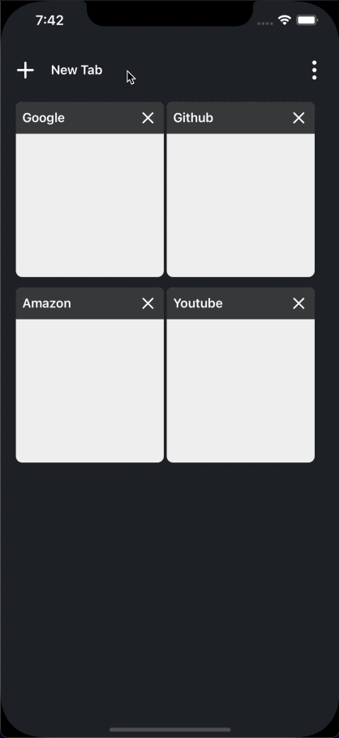
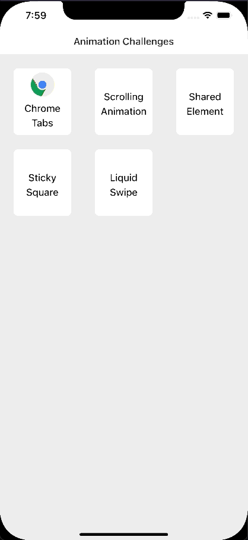
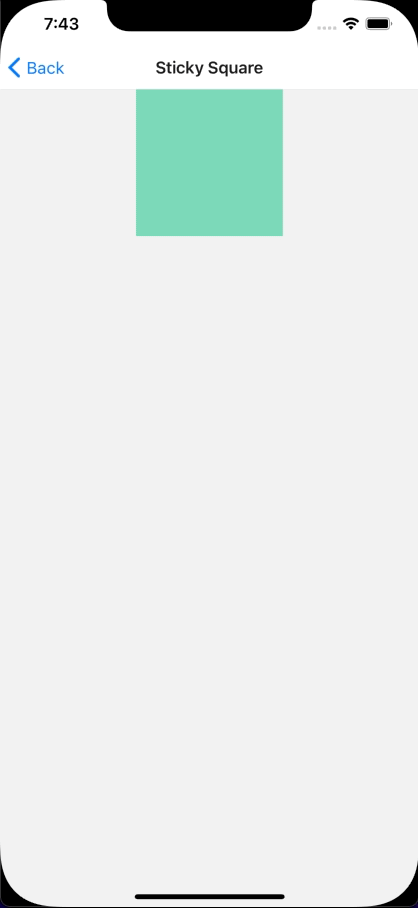

# Animation Challenges
## App to practice animation concepts such as:
- Gestures
- React Native Reanimated (2+)
- SVG animations
- Test some ready to use animations

## Contents
- [x] Chrome Tabs (draggable tabs)
- [x] Scrollling Animations
- [x] Shared Element Transition (Tested **react-navigation-shared-element**)
- [x] Sticky Square (SVG challenge)
- [x] Liquid Swipe (SVG challenge)

## Notes
Some of the challenges are based on [William Candillon's youtube channel](https://www.youtube.com/user/wcandill)

#### Liquid Swipe
On Android the mask animation still need some work for a better performance. In my opinion, it would be better to integrate a native component that does this animation, it would perform better on android.

## GIFS

#### Chrome Tabs
 

#### Scrolling Animation

#### Shared Elements

#### Sticky Square
 

#### Liquid Swipe

